# Examples

This document lists all built-in examples and templates included in the app.

## Help Sidebar Snippets

These are the snippets shown in the **Examples & Help** sidebar.

### Sequence

#### BASICS

**Simple Message** — -> for sync call

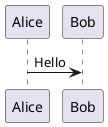

**Return Message** — --> for response

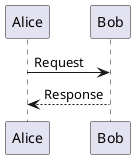

**Self-Message** — Recursive call

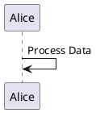

#### PARTICIPANTS

**Types** — Different visual shapes

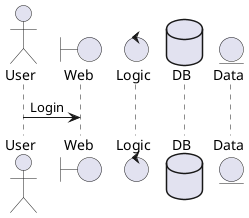

**Colors & Styles** — Customizing appearance

```plantuml
@startuml
skinparam sequenceMessageAlign center
participant Alice #AliceBlue
participant Bob #technology
Alice -> Bob: Styled
@enduml
```

#### CONTROL FLOW

**Alt/Else (Choices)** — Conditional branching

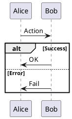

**Loop** — Iteration

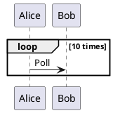

**Parallel (Par)** — Concurrent actions

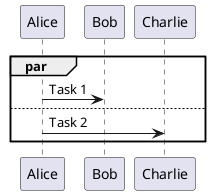

#### ADVANCED

**Activation** — Show execution focus

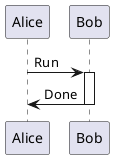

**Notes** — Add explanations

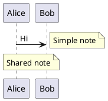

### Use Case

#### BASICS

**Simple Use Case** — Actor and usecase

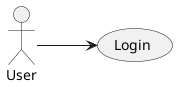

#### RELATIONSHIPS

**Include/Extend** — Advanced relations

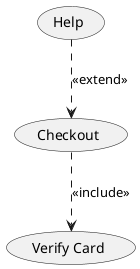

### Class

#### BASICS

**Simple Class** — Definition with fields

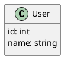

**Methods** — Functions with parameters

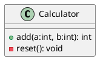

#### VISIBILITY

**Access Levels** — Standard UML access markers

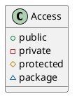

**Abstract/Static** — Keywords in braces

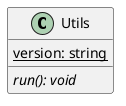

#### RELATIONSHIPS

**Inheritance** — IS-A (Generalization)

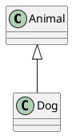

**Composition** — Whole-part (Strong)

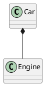

**Aggregation** — Whole-part (Weak)

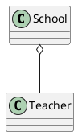

### Object

#### BASICS

**Instance** — Concrete instances

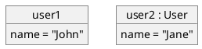

### Activity

#### BASICS

**Flow** — Simple linear flow

```plantuml
@startuml
start
:Step 1;
:Step 2;
stop
@enduml
```

#### CONTROL FLOW

**If/Then/Else** — Branching

```plantuml
@startuml
start
if (Test) then (yes)
  :A;
else (no)
  :B;
endif
stop
@enduml
```

**While Loop** — Iteration

```plantuml
@startuml
start
while (Has Data?) is (yes)
  :Process;
endwhile (no)
stop
@enduml
```

#### ADVANCED

**Swimlanes** — Responsibility lanes

```plantuml
@startuml
|User|
start
:Login;
|Server|
:Validate;
|User|
:Result;
stop
@enduml
```

### Component

#### BASICS

**Components** — Basic components

```plantuml
@startuml
[First Component]
[Second Component] as Comp2
[First Component] ..> Comp2 : use
@enduml
```

#### PACKAGES

**Grouping** — Package grouping

```plantuml
@startuml
package "Backend" {
  [API]
  [Worker]
}
package "Frontend" {
  [Web App]
}
[Web App] --> [API]
@enduml
```

### Deployment

#### BASICS

**Nodes** — Physical nodes

```plantuml
@startuml
node "Web Server" {
  [Apache]
}
node "DB Server" {
  database MySQL
}
[Apache] --> MySQL
@enduml
```

### State

#### BASICS

**Transitions** — Start/Stop flow

```plantuml
@startuml
[*] --> Idle
Idle -> Active : Start
Active -> [*] : Stop
@enduml
```

#### ADVANCED

**Composite** — Nested states

```plantuml
@startuml
state Active {
  [*] --> Loading
  Loading --> Ready
}
@enduml
```

**Guards** — Conditional transitions

```plantuml
@startuml
Idle -> Active : [auth == true]
@enduml
```

### Timing

#### BASICS

**Digital** — Time-based state

```plantuml
@startuml
robust "Web Browser" as WB
concise "User" as U

@0
U is Idle
WB is Idle

@100
U is Waiting
WB is Processing

@300
WB is Idle
@enduml
```

### JSON / YAML

#### DATA

**JSON View** — Visualize JSON

```plantuml
@startjson
{
  "name": "Reflex",
  "tags": ["Web", "Python"],
  "active": true
}
@endjson
```

**YAML View** — Visualize YAML

```plantuml
@startyaml
name: PlantUML
version: 1.0
features:
  - simple
  - text-based
@endyaml
```

### EBNF / Regex

#### GRAMMAR

**EBNF** — Syntax grammar

```plantuml
@startebnf
group = "(" , expression , ")";
expression = term , { "+" | "-" , term };
term = factor , { "*" | "/" , factor };
@endebnf
```

**Regex** — Regex visualization

```plantuml
@startregex
[a-z0-9._%+-]+@[a-z0-9.-]+\\.[a-z]{2,4}
@endregex
```

### Network (nwdiag)

#### TOPOLOGY

**Simple Network** — Network diagram

```plantuml
@startnwdiag
nwdiag {
  network dmz {
    address = "210.x.x.x/24"
    web01 [address = "210.x.x.1"];
    web02 [address = "210.x.x.2"];
  }
  network internal {
    web01;
    web02;
    db01;
  }
}
@endnwdiag
```

### UI Mockups (Salt)

#### WIREFRAMES

**Window** — UI components

```plantuml
@startsalt
{
  Just plain text
  [This is my button]
  ()
  (X)
  [X] Checkbox
  "Input field"
  ^Droplist^
}
@endsalt
```

### Archimate

#### ENTERPRISE

**Basic** — Enterprise architecture

```plantuml
@startuml
archimate #Technology "VPN Server" as vpnServerA <<technology-device>>
archimate #Technology "VPN Server" as vpnServerB <<technology-device>>
package "Legacy" {
  node "Mainframe" as mainframe
}
vpnServerA --> mainframe
@enduml
```

### SDL

#### FLOW

**Process** — Specification lang

```plantuml
@startuml
:start;
:message;
stop
@enduml
```

### Ditaa

#### ASCII

**Blocks** — ASCII art diagrams

```plantuml
@startditaa
+--------+   +-------+    +-------+
|        | --+ ditaa +--> |       |
|  Text  |   +-------+    |diagram|
|Document|   |!magic!|    |       |
|     {d}|   |       |    |       |
+---+----+   +-------+    +-------+
    :                         ^
    |       Lots of work      |
    +-------------------------+
@endditaa
```

### Gantt

#### PROJECT

**Timeline** — Project schedule

```plantuml
@startgantt
[Prototype design] lasts 15 days
[Code prototype] lasts 10 days
[Write tests] lasts 5 days
[Code prototype] starts at [Prototype design]'s end
[Write tests] starts at [Code prototype]'s start
@endgantt
```

### Chronology

#### TIMELINE

**Events** — Chronological events (Timing)

```plantuml
@startuml
clock clk with period 1
binary "enable" as en

@0
en is low

@5
en is high

@10
en is low
@enduml
```

### MindMap

#### HIERARCHY

**Ideas** — Brainstorming

```plantuml
@startmindmap
* Root
** Idea 1
*** Sub Idea 1
** Idea 2
@endmindmap
```

### WBS

#### WORK

**Breakdown** — Work breakdown

```plantuml
@startwbs
* Project
** Phase 1
*** Task 1
*** Task 2
** Phase 2
@endwbs
```

### Mathematics

#### FORMULAS

**AsciiMath** — Mathematical equations

```plantuml
@startmath
f(t)=(a_0)/2 + sum_(n=1)^oo a_n cos((n pi t)/L) + sum_(n=1)^oo b_n \\sin((n pi t)/L)
@endmath
```

### Database (ER)

#### ENTITIES

**Basic Entity** — Table definition

```plantuml
@startuml
entity Table {
  * id: int <<PK>>
  --
  data: string
}
@enduml
```

**Relationships** — Cardinality notation

```plantuml
@startuml
User ||--o{ Post : writes
@enduml
```

## Other Built-in Templates

These templates exist in the codebase (diagram template selector).

### Sequence

```plantuml
@startuml
actor User
participant "First Class" as A
participant "Second Class" as B

User -> A: DoWork
activate A

A -> B: Create Request
activate B

B --> A: Request Created
deactivate B

A --> User: Done
deactivate A
@enduml
```

### Use Case

```plantuml
@startuml
left to right direction
actor "Food Critic" as fc
rectangle Restaurant {
  usecase "Eat Food" as UC1
  usecase "Pay for Food" as UC2
  usecase "Drink" as UC3
}
fc --> UC1
fc --> UC2
fc --> UC3
@enduml
```

### Class

```plantuml
@startuml
class Car {
  - engine: Engine
  + start(): void
  + stop(): void
}

class Engine {
  - power: int
  + start(): void
}

Car *-- Engine
@enduml
```

### Activity

```plantuml
@startuml
start
:Hello world;
:This is defined on
multiple lines;
stop
@enduml
```

### Component

```plantuml
@startuml
package "Some Group" {
  HTTP - [First Component]
  [Another Component]
}

node "Other Groups" {
  FTP - [Second Component]
  [First Component] --> FTP
} 
@enduml
```

### State

```plantuml
@startuml
[*] --> State1
State1 --> [*]
State1 : this is a string
State1 : this is another string

State1 -> State2
State2 --> [*]
@enduml
```

### Object

```plantuml
@startuml
object Object01
object Object02
object Object03

Object01 <|-- Object02
Object03 *-- Object01
@enduml
```

## Default Document Sample

This is the initial document content when a new shared document is created.

```plantuml
@startuml
participant User
participant "Web App" as App
participant "PlantUML Server" as Server

User -> App: Type PlantUML code
activate App
App -> App: Detect diagram type
App -> Server: Send encoded text
activate Server
Server --> App: Return SVG image
deactivate Server
App --> User: Display Diagram
deactivate App
@enduml
```
